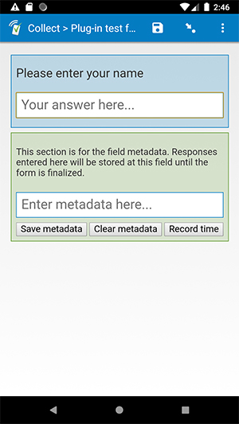

# feature-demo-metadata

## Description

This field plug-in is meant to demonstrate how to use field metadata. It adds a second input box below the regular text input, which will store metadata. This value is stored separately from the field's response. Learn more about field metadata in the [API reference documentation](https://github.com/surveycto/field-plug-in-resources/blob/master/docs/api-reference.md).

*Note: this is not intended to be used to collect actual data. It is intended for demonstration/testing purposes.*

## How to use

1. Download the example form [extras/example-form](extras/example-form) from this repo and upload it to your SurveyCTO server.
1. Download the [feature-demo-metadata.fieldplugin.zip](feature-demo-metadata.fieldplugin.zip) file from this repo, and attach it to the example form on your SurveyCTO server.

## More resources

* **Example form**  
[extras/example-form](extras/example-form)

* **Developer documentation for field plug-ins**  
More instructions for developing field plug-ins.  
[https://github.com/surveycto/Field-plug-in-resources](https://github.com/surveycto/Field-plug-in-resources)

* **User documentation for field plug-ins**  
How to get started using field plug-ins in your SurveyCTO form.  
[https://docs.surveycto.com/02-designing-forms/03-advanced-topics/06.using-field-plug-ins.html](https://docs.surveycto.com/02-designing-forms/03-advanced-topics/06.using-field-plug-ins.html)
